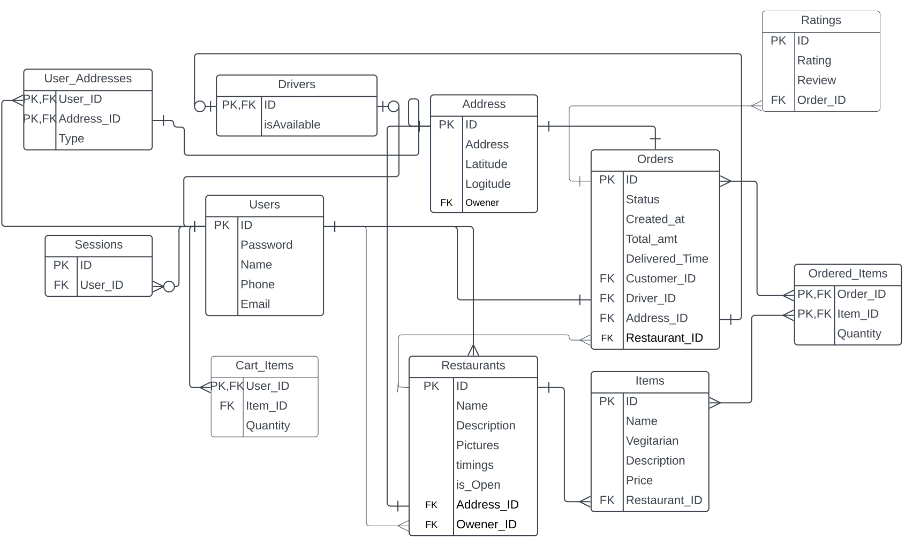

# FoodieFleet

A Food Delivery Application

## 1. Business Description

**Web Application Goals**

Our website will be the primary touchpoint for customers, restaurant partners, and delivery drivers. This will be the center part of our product and it will have 3 primary goals

1. Ordering Food
2. Tracking Delivery
3. Managing Customers, Restaurants and Delivery Drivers

To Meet These Objectives we have following criteria

- Proper and intuitive UI for the users
- Frontend Application with 3 diffrent interfaces

  1. Customer Interface
  2. Restaurant Interface
  3. Delivery Driver Interface

1. _Customer Interface_ Should have the following functionalities

- List of Restaurants
- Seperate Page for each restaurant
- Menu in Each restaurant page
- Option to order food on Click
- Totaling the order price
- Placing the order
- Tracking the delivery driver on map
- Add Search option to search the restauarants
- Add Authentication
- Notifiation service for the delivery information

2. _Restaurant Interface_ Should have the following Functionalities

- Page to confirm the orders with displaying the order details
- option to notify if the order is done
- Add Authentiaction
- Notifiation service for the order information

3. _Delivery Driver Interface_ should have the following functionalities

- Page to get the display an order
- Delivery Direction on Map
- Confrimation button once delivered
- option to tell that the driver is open to deliver
- Add Authetication'

## 2. Data Modeling:

## 3. Project Plan:

#### Zero-th Phase:

- [x] Create a Data Model based on Desc.
- [x] Create api contracts for the same.
- [x] Build a project Plan.

#### First Phase:

- [x] Hardcoded 1 Restaurant,1 item,delivery partner, 1 user...
- [x] Basic Flow

#### Second Phase:

- [x] Multiple items and UI
- [x] Multiple Restaurants and CRUD and UI
- [x] Restaurant Interface

#### Third Phase:

- [x] Multiple users
- [x] Login Sign Up and Auth

#### Fourth Phase:

- [x] Delivery Partner Multiple CRUD and UI
- [x] Understanding and modifying the Map based on Needs
- [x] Tracking Delivery Executive
- [x] Calculating Delivery time and route
- [x] Working on UI
- [x] Refining the application

#### Upcoming Features(Could be added in future)

- [ ] Adding Search
- [ ] Calculating Total time
- [ ] Using socket.io instead of ws

## 4. API Contracts:

### Users

`createUser:`
POST /users
\
Creates a user with the following params

Parameters:

- username: Choosen username by the user
- password: Choosen password by the user
- name: User's name
- phone: User's phone number
- email: User's email

Response Body:

- Response Bodys a object that has user details

Response Status:

- 201:Created

---

`getUser:`
GET /users/:id'
\
gets a username details

Path Parameters:

- id : Username

Response Body:

- An Object that contains the user details like name,phone,email in key value pair

Response Status:

- 200:OK

---

`updateUser:`
PUT /users/:id
\
update a user

Path Parameters:

- id :Username

Parameters:

- username: Choosen username by the user
- password: Choosen password by the user
- name: User's name
- phone: User's phone number
- email: User's email

Response Body:

- Response Bodys a object that would contain the updated result

Response Status:

- 200:OK

---

`deleteUser:`
DELETE /users/:id
\
delete a user

Path Parameters:

- id :User name

Response Status:

- 204:No Content

---

### Orders

`createOrder`
POST /orders
\
Parameters:

- UserID: User ID
- resaurantID: Restaurant ID
- items: JSON Object with all the items and quantity

Response Body:

- All the details of that order with total amt and orderID

Response Status:

- 201:Created

---

`getCurrentOrders:`
GET /orders/current
\
get the current order details

Query Parameters:

- user-id:to get current order of user id
- restaurant-id:to get the current orders of restaurant-id filter
- driver-id:to get current order of driver-id filter

Response Body:

- Response Bodys a list of orders and details as a object based on filters

Response Status:

- 200:OK

---

`getOrders:`
GET /orders
\
Read all orders

Query Parameters:

- user-id:to get orders of user id
- restaurant-id:to get the orders of restaurant-id filter
- driver-id:to get orders of driver-id filter

Optional Path Param:

Response Body:

- Response Bodys a object with the details of all the previous orders of the user

Response Status:

- 200:OK

`getOrder:`
GET /orders/:id
\
To get order based on id

path Parameters:

- id:Order Id

Response Body:

- All the details of that order with total amt and orderID

Response Status:

- 200:OK

---

`updateOrderStatus:`
PATCH /orders/:id
\
Update order Status based on id

path Parameters:

- id:Order Id

Parameter:

- status:order status

Response Body:

- boolean true to confirm

Response Status:

- 200:OK

---

`getCart`
GET /cart
\
Parameters:

- resaurantID: Restaurant ID

Cookie: UserID: User ID

Response Body:

- items: JSON Object with all the items and quantity

Response Status:

- 200:OK

---

`updateCart`
PUT /cart/
\
Parameters:

- itemID: Item ID
- quantity: Quantity

Cookie: UserID: User ID

Response Body:

- Respective ItemID and quantity that are modified

Response Status:

- 200:OK

---

---

### Driver Executive

`createDeliveryExecutive:`
POST /driver
\
Creates a delivery executive with a given existing username

Parameters:

- id:User Name that wants to be the driver

Response Body:

- Response Body true if sucessfully created a delivery partner with that specified username

Response Status:

- 201:Created

---

`getDeliveryExecutive:`
GET /driver/:id
\
get delivery executive details

Query Parameters:

- filter:location(get delivery location),status(get driver status)

Path Parameters:

- id:Driver ID

Response Body:

- An Object with all the details of delivery executitive including user details

Response Status:

- 200:OK

---

`updateDriverLocation:`
PATCH /driver/:id/
\
Updates the driver's current location

Path Parameters:

- id:Driver ID

Parameters:

- Latitude:Latitude of the driver
- Logitude:Logitude of the driver

Response Body:

- Response Bodys an object with latitude and logitude of the location of the driver

Response Status:

- 200:OK

---

---

`updateDriverStatus:`
PATCH /driver/:id/
\

Updates the driver status like is he/she is available to take orders

Path Parameters:

- id:Driver ID

Parameters:

- status: The current status of the driver like are they available,unavailable,busy

Response Body:

- Response Bodys boolean true as a confirmation

Response Status:

- 200:OK

---

`deleteDelivery:`
DELETE /driver/:id
\
Deletes the specified user as a delivery execitive

Path Parameters:

- id:Driver ID

Response Status:

- 204:No Content

---

### Restaurant

`createRestaurant:`
POST /restaurant
\

Creates a new Restaurant associated with the specified username

Parameters:

- username: User ID of the user that wants to create a resaurant
- restaurantName:The specified Restaurant name
- latitude: The latitude of that Restaurant
- longitude: The logitude of that Restaurant
- description: The description of that resaurant
- pictures: The pictures uploaded by the owener

Response Body:

- Restaurant Details as object with restaurantID

Response Status:

- 201:Created

---

`getRestaurant:`
GET /restaurant/:id
\
Gets the resaurant Details

Path Parameters:

- id: Restaurant ID

Response Body:

- Restaurant Details as object

Response Status:

- 200:OK

---

`getAllRestaurants:`
GET /restaurant
\
Gets all the restaurants owened

Query Parameters:

- user-id: restaurants based on the user id

Response Body:

- Details of all the restaurants owened

Response Status:

- 200:OK

---

`updateRestaurant:`
PUT /restaurant/:id
\
Update the resaurant Details

Path Parameters:

- id: Restaurant ID

Parameters:

- username: User ID of the user that wants to create a resaurant
- restaurantName:The specified Restaurant name
- latitude: The latitude of that Restaurant
- longitude: The logitude of that Restaurant
- description: The description of that resaurant
- pictures: The pictures uploaded by the owener

Response Body:

- The updated Restaurant Details

Response Status:

- 200:OK

---

`updateRestaurantStatus:`
PATCH /restaurant/:id
\
Update restaurant status

Parameters:

- isOpen: Boolean

Response Body

- True to confirm

Response Status:

- 200:OK

`deleteRestaurant:`
DELETE /restaurant/:id
\
Delete the resaurant

Path Parameters:

- id: Restaurant ID

Response Status:

- 204:No Content

---

`createItem:`
POST /restaurant/:restaurantID/item/
\
Create a item for a specific Restaurant

Path Parameters:

- restaurantID: Restaurant id that wants to add the item

Parameters:

- Name: Name of the item
- Description: Description of the item
- Vegitarian: boolean to specify the type of the dish
- Price: Price of the item

Response Body:

- Details of that item in a object with itemID

Response Status:

- 201:Created

---

`getItem:`
GET /restaurant/:restaurantID/item/:itemID
\
Read a perticualar item in a object with itemID and restaurant id

Path Parameters:

- itemID:ItemID of the item

Response Body:

- Response Bodys a details of that item in Object

Response Status:

- 200:OK

---

`getItemsList:`
GET /restaurant/:restauantID/item
\
Read a list of item that exists in the item list

Path Parameters:

- restaurantID:ID of that restaurant

Response Body:

- Details of all the items that the restaurant has

Response Status:

- 200:OK

---

`updateItem:`
PUT /restaurant/:restauantID/item/:itemID
\
Update a perticular item

Path Parameters:

- restaurantID:ID of that restaurant
- itemID:id of that item

Parameters:

- Name: Name of the item
- Description: Description of the item
- Vegitarian: boolean to specify the type of the dish
- Price: Price of the item

Response Body:

- Response Body a object with updated item details

Response Status:

- 200:OK

---

`deleteItem:`
DELETE /restaurant/:restauantID/item/:itemID
\
Delete a item

Path Parameters:

- restaurantID:ID of that restaurant
- itemID:id of that item

Response Status:

- 200:OK

---

---

### Session

`createSession:`
POST /session
\
Parameters:

- username:User Name
- password:Password

Response Body:

- Session Cookie with sessionID and username

Response Status:

- 201:Created

`getSession:`
GET /session
\
Parameters:(Session Cookie)

Response Status:

- 204:No Content
- 401:Unauthorized

`deleteSession:`
DELETE /session
\
Parameters:(Session Cookie)

Response Status:

- 204:No Content
